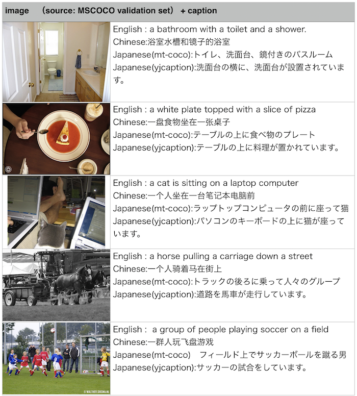

# image caption generation by chainer 

## Notes after two years.
I created this basically when I was almost undergrad and then things changed a lot! I feel a bit ashamed to show my dirty coding :) Well, the pretrained models are still effective and probably good if you just want to try generating captions in English/Chinese/Japanese. However, when it comes to training, probably not the best one, and many algorithmic improvements happened after I stop the maintenance of this code base… 

If you want to train image captioning, I highly recommend pytorch rather than chainer. I stopped using chainer because it always broke the compatibility when I upgrade it. For example, this code is written in chainer 1.x and never works in 2.x, 3.x, 4.x, … and 6.x (see how quickly they change the version! ). *1

If you still want to stay on this code, here’s some note that you should know


- I used python 2.7 at that time, and this code may not work with python3 or higher. 
Make sure to use chainer 1.x. I tested on 1.24.0 with CUDA 8 (cuda 9 and chainer 1.x doesn’t work together). 

- I put more formal description of requirements in the later section so see it and please try to use miniconda (or anaconda) to reproduce the environment. 


- I tried to change the code to make it possible to finetune the CNN part, then I kind of failed to document it, and now I don’t remember what I was doing :)  Some files are leftovers that you don't need to use... e.g. `train_image_caption_model.py` is the leftover while `train_caption_model.py` is the good one. 

 *1 This does NOT mean i do not like chainer anymore. It's still great tool to quickly prototype from scratch. I just want to say, if you want to minimize the maintenance effort for a long term, probably it is not the right tool, because of the frequent major version up that breaks the downward compatibility.

## descrtiption

This repository contains an implementation of typical image caption generation based on neural network (i.e. CNN + RNN). The model first extracts the image feature by CNN and then generates captions by RNN. CNN is ResNet50 and RNN is a standard LSTM .

The training data is MSCOCO. I preprocessed MSCOCO images by extracting CNN features in advance. Then I trained the language model to generate captions. Not only English, I trained on Japanese and Chinese. 

I made pre-trained models available. For English captions, the model achieves CIDEr of 0.692 (Otheres are Bleu1: 0.657,  Bleu2: 0.471, Bleu3: 0.327, Bleu4: 0.228,  METEOR: 0.213, ROUGE_L: 0.47)  for the MSCOCO validation dataset. The scores are increased a little bit when the beam search is used. For example, CIDEr is 0.716 with beam size of 5. If you want to achieve a better score, CNN has to be fine-tuned, but I haven’t tried because it’s computationally heavier.  



## requirements
- python 2.7
- CUDA 8.0
- chainer 1.24.0  http://chainer.org

and some more packages. Make sure to use this version of chainer by `pip install chainer==1.24.0`. Different versions easily break the compatability.  

I use `conda` to manage the environment and here's what I did. 
```
conda create  -y  --prefix=conda python=2.7
conda deactivate
conda activate ./conda
conda install --yes numpy scipy matplotlib pandas pillow #normal tools
CUDA_PATH=/usr/local/cuda-8.0/ pip install chainer==1.24.0 --no-cache-dir
CUDA_PATH=/usr/local/cuda-8.0/ pip install cupy==2.0
pip install h5py
pip install nltk
```
You can also see my [`env.yml`](./data/env.yml) that is basically the exact environment of mine. 


## citation:
If you find this implementation useful, please consider to cite: 
```
@article{multilingual-caption-arxiv,
title={{Using Artificial Tokens to Control Languages for Multilingual Image Caption Generation}},
author={Satoshi Tsutsui, David Crandall},
journal={arXiv:1706.06275},
year={2017}
}

@inproceedings{multilingual-caption,
author={Satoshi Tsutsui, David Crandall},
booktitle = {CVPR Language and Vision Workshop},
title = {{Using Artificial Tokens to Control Languages for Multilingual Image Caption Generation}},
year = {2017}
}
```

## I just want to generate caption!
OK, first, you need to download the models and other preprocessed files.
```
bash download.sh
```
Then you can generate caption.
```
#English
python sample_code_beam.py \
--rnn-model ./data/caption_en_model40.model \
--cnn-model ./data/ResNet50.model \
--vocab ./data/MSCOCO/mscoco_caption_train2014_processed_dic.json \
--gpu -1 \
--img ./sample_imgs/COCO_val2014_000000185546.jpg \

#Japanese trained from machine translated Japanese (https://github.com/apple2373/mt-mscoco)
python sample_code_beam.py \
--rnn-model ./data/caption_jp_mt_model40.model \
--cnn-model ./data/ResNet50.model \
--vocab ./data/MSCOCO/captions_train2014_jp_translation_processed_dic.json \
--gpu -1 \
--img ./sample_imgs/COCO_val2014_000000185546.jpg \


#Japanese by YJCaptions (https://github.com/yahoojapan/YJCaptions)
python sample_code_beam.py \
--rnn-model ./data/caption_jp_yj_model40.model \
--cnn-model ./data/ResNet50.model \
--vocab ./data/MSCOCO/yjcaptions26k_clean_processed_dic.json \
--gpu -1 \
--img ./sample_imgs/COCO_val2014_000000185546.jpg \

#Chinese trained from machine translated Chinese (https://github.com/apple2373/mt-mscoco)
python sample_code_beam.py \
--rnn-model ./data/caption_cn_model40.model \
--cnn-model ./data/ResNet50.model \
--vocab ./data/MSCOCO/captions_train2014_cn_translation_processed_dic.json \
--gpu -1 \
--img ./sample_imgs/COCO_val2014_000000185546.jpg \

```
See the help for other options. You can, for example, use beam search if you want. 

## I want to run caption generation module as a web API.
I have a simple script for that.
```
cd webapi
python server.py --rnn-model ../data/caption_en_model40.model \
--cnn-model ../data/ResNet50.model \
--vocab ../data/MSCOCO/mscoco_caption_train2014_processed_dic.json \
--gpu -1 \

curl -X POST -F image=@./sample_imgs/COCO_val2014_000000185546.jpg http://localhost:8090/predict
#you should get json
```


## I want to train the model by myself.
I made the preprocessed files (e.g., extracted ResNet features) available. You can download like this.
```
bash download.sh train
```
Then you can train like this.
```
# Preprocessing

cd ./code/

## English
## make sure to downalod captions_train2014.json  from the orignal MSCOCO! 
python preprocess_MSCOCO_captions.py \
--input ../data/MSCOCO/captions_train2014.json \
--output ../data/MSCOCO/mscoco_caption_train2014_processed.json -\
-outdic ../data/MSCOCO/mscoco_caption_train2014_processed_dic.json \
--outfreq ../data/MSCOCO/mscoco_caption_train2014_processed_freq.json 

## Japanese from Yahoo
python preprocess_MSCOCO_captions.py \
--input ../data/MSCOCO/yjcaptions26k_clean.json \
--output ../data/MSCOCO/yjcaptions26k_clean_processed.json \
--outdic ../data/MSCOCO/yjcaptions26k_clean_processed_dic.json \
--outfreq ../data/MSCOCO/yjcaptions26k_clean_processed_freq.json \
--cut 0 \
--char True \

## Japanese from machine translation
python preprocess_MSCOCO_captions.py \
--input ../data/MSCOCO/captions_train2014_jp_translation.json \
--output ../data/MSCOCO/captions_train2014_jp_translation_processed.json \
--outdic ../data/MSCOCO/captions_train2014_jp_translation_processed_dic.json \
--outfreq ../data/MSCOCO/captions_train2014_jp_translation_processed_freq.json \
--cut 5 \
--char True \

## Chinese from machine translation
python preprocess_MSCOCO_captions.py \
--input ../data/MSCOCO/captions_train2014_cn_translation.json \
--output ../data/MSCOCO/captions_train2014_cn_translation_processed.json \
--outdic ../data/MSCOCO/captions_train2014_cn_translation_processed_dic.json \
--outfreq ../data/MSCOCO/captions_train2014_cn_translation_processed_freq.json \
--cut 5 \
--char True \

cd ../

# Train
## train English caption 
python train_caption_model.py --savedir ./experiment1 --epoch 40 --batch 120 --gpu -1 \
--vocab ./data/MSCOCO/mscoco_caption_train2014_processed_dic.json \
--captions ./data/MSCOCO/mscoco_caption_train2014_processed.json \

## train Chinese caption by machine translation
python train_caption_model.py --savedir ./experiment1cn --epoch 50 --batch 120 --gpu 0 \
--vocab ./data/MSCOCO/captions_train2014_cn_translation_processed_dic.json \
--captions ./data/MSCOCO/captions_train2014_cn_translation_processed.json\

## train Japanese caption by machine translation
python train_caption_model.py --savedir ./experiment1jp_mt --epoch 40 --batch 120 --gpu 0 \
--vocab ./data/MSCOCO/captions_train2014_jp_translation_processed_dic.json \
--captions ./data/MSCOCO/captions_train2014_jp_translation_processed.json\
--preload True

## train Japanese caption by Yahoo's 
python train_caption_model.py --savedir ./experiment1jp_yj --epoch 40 --batch 120 --gpu 0 \
--vocab ./data/MSCOCO/yjcaptions26k_clean_processed_dic.json \
--captions ./data/MSCOCO/yjcaptions26k_clean_processed.json \
--preload True
```

## I want to train the model from my own data.
Alright, you need to do additional amount of work.
```
cd code
#extract features using ResNet50 \
python ResNet_feature_extractor.py --img-dir ../data/MSCOCO/train2014 \
 --out-dir ../data/MSCOCO/train2014_ResNet50_features \
  --gpu -1
```
`--gpu` is GPU id (-1 is CPU).`—img-dir` is the directory that you stores images. `—out-dir` is the directory that the ResNet features will be saved. The file name will be the same, but extension is “.npz”.   
```
#preprocess the json files. you need to have the same structure as MSCOCO json.
python preprocess_MSCOCO_captions.py \
--input ../data/MSCOCO/captions_train2014.json \
--output ../data/MSCOCO/mscoco_caption_train2014_processed.json \
--outdic ../data/MSCOCO/mscoco_caption_train2014_processed_dic.json \
--outfreq ../data/MSCOCO/mscoco_caption_train2014_processed_freq.json \
—-cut 5 \
—-char True 
```
`input` is the json file containing caption. `output` will be the main preprocessed output. `outdic` is the vocabulary file. `outfreq` is the internal file you don’t need it in the training. Just frequency count. `cut` is the cutoff frequency for minor words. Character based chunking will be used when `char` is True. You can use it for non-spaced languages like Japanese and Chinese. 
  
Then you can use my script above for training. 

## I want to fine-tune CNN part. 
Officially, this doesn’t support the CNN tuning. That’s what I did in the original paeper. However, informally, I made it to train CNN part too... but I didn't document it, now,  after two years, I don't remember very much. `train_image_caption_model.py` is the script to train the CNN part. I also remember that I tried to use another preprocessed json than I document here. Currently I have the `_dic` file and the main processed file separately but I combined them. The script to generate a preprocessed file in the new format (i.e that one compatible with `train_image_caption_model.py` ) should be `code/preprocess_captions.py`. That's what I vaguely remember. 
